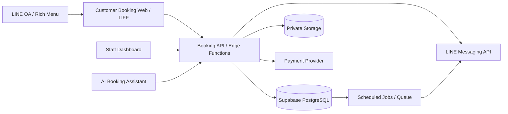
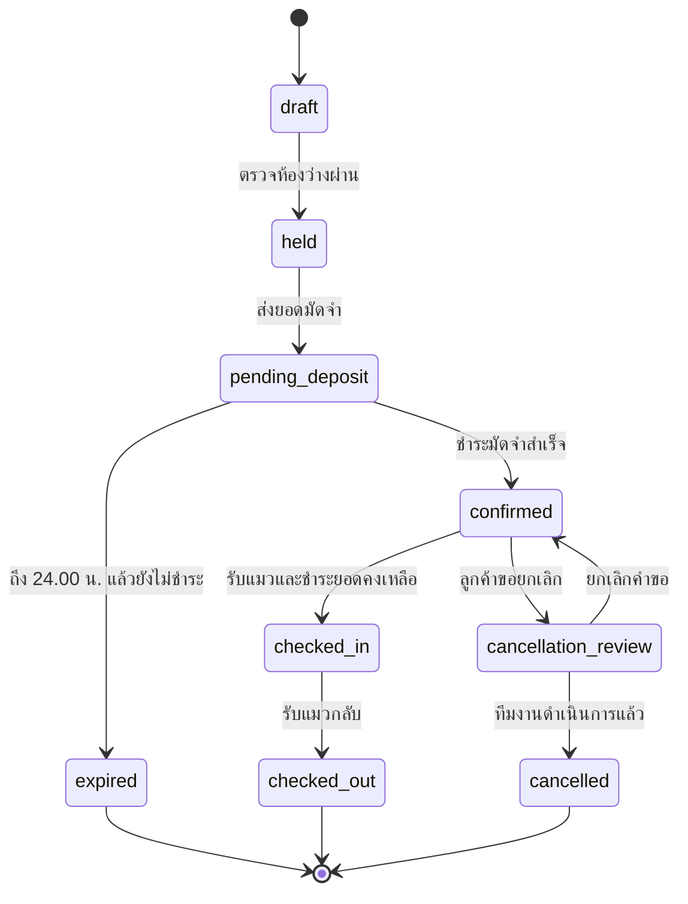

# System Architecture

Document Type: Architecture  
Version: 1.0  
Status: Ready for Development

## ภาพรวม

## ส่วนประกอบ

### Customer Booking Web

- Mobile-first และเปิดจาก LINE OA
- ใช้ LIFF/LINE Login เมื่อพร้อม เพื่อเชื่อม LINE user ID
- แสดงเฉพาะประเภทห้องและสถานะที่ระบบอนุญาต
- ไม่เข้าถึงตาราง booking/payment โดยตรง
- เรียก Edge Functions เพื่อสร้าง hold, ตรวจราคา และยืนยันการจอง

### Staff Dashboard

- Supabase Auth สำหรับพนักงาน
- บทบาทขั้นต่ำ: owner, manager, front_desk, caregiver, viewer
- ปฏิทินห้อง รายการงาน และข้อมูลดูแลตามสิทธิ์
- การคืนเงินและการ override ต้องจำกัด owner/manager

### Booking API

- เป็นจุดควบคุมธุรกรรมการตรวจห้องและจำนวนแมว
- ล็อกและตรวจข้อมูลใน transaction เดียวก่อนสร้าง hold/confirmation
- คืนค่าราคาและยอดมัดจำจากฐานข้อมูล ไม่รับราคาจาก client
- ใช้ idempotency key ป้องกันการกดซ้ำ
- เขียน status history และ audit log ทุกครั้ง

### Database

- Supabase PostgreSQL เป็น Single Source of Truth
- ใช้ UUID เป็น primary key และ snake_case
- ใช้ `timestamptz` สำหรับเวลาและ `date` สำหรับ business date
- RLS ทุกตารางใน exposed schema
- ไม่เปิด public write policy ต่อตาราง booking/payment

### Storage

- bucket เอกสารสุขภาพเป็น private
- จำกัดชนิดไฟล์ รูป/PDF และขนาดไฟล์
- path ต้องไม่ใช้ชื่อหรือเบอร์โทรตรง ๆ
- พนักงานเข้าถึงผ่าน signed URL อายุสั้นตามสิทธิ์

## Availability Transaction

ทุกครั้งที่ถือห้องหรือยืนยันการจอง ระบบต้องตรวจใน transaction เดียว:

1. ช่วงวันและเวลา valid
2. จำนวนแมวตรงกับรายการแมว
3. จำนวนแมวไม่เกินความจุของประเภทห้อง
4. ห้องไม่มี allocation ที่ทับซ้อนในสถานะ active
5. จำนวนแมวรวมทุก booking ที่ active ในแต่ละวันไม่เกิน 30
6. hold ยังไม่หมดอายุ
7. สร้าง booking, allocation และ status history สำเร็จพร้อมกัน

หากข้อใดไม่ผ่านต้อง rollback ทั้งหมด

## สถานะการจอง

## การตัดเวลา

- ระบบเก็บเวลาเป็น UTC แต่คำนวณ business cutoff ด้วย `Asia/Bangkok`
- deposit deadline คือ 24.00 น. ของวันที่สร้างรายการตามเวลาไทย
- scheduled job เปลี่ยนรายการค้างชำระเป็น expired และปล่อยห้อง
- ต้องรองรับ retry แบบ idempotent

## หมายเหตุ Supabase ปัจจุบัน

- ตารางใหม่อาจไม่ถูกเปิดสู่ Data API อัตโนมัติ ต้องกำหนด schema exposure และ grants อย่างตั้งใจ
- Storage upload ต้องมี RLS ที่เหมาะกับ INSERT และ SELECT; upsert ต้องมี UPDATE เพิ่ม
- service role ใช้เฉพาะ server/Edge Function และห้ามส่งไป client

